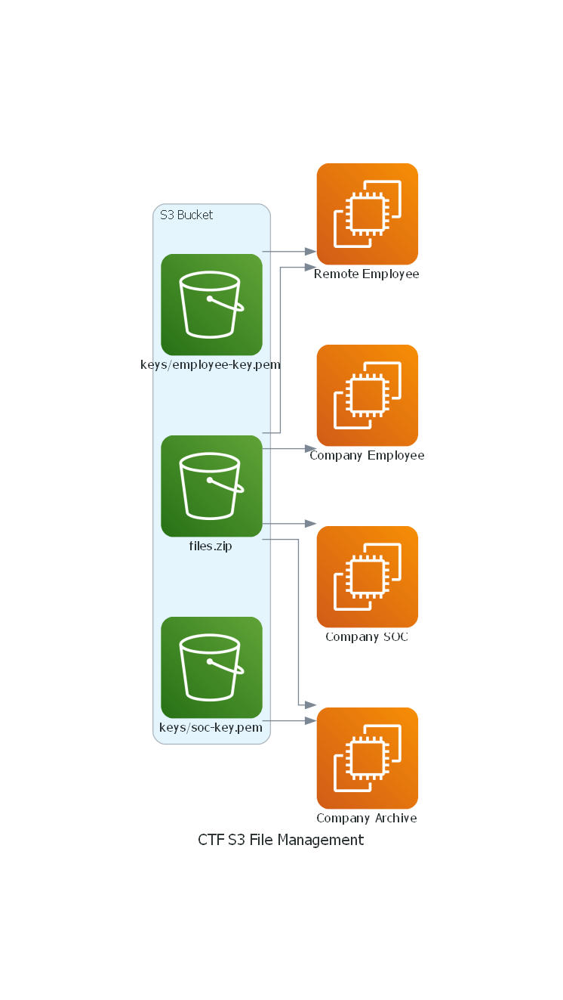
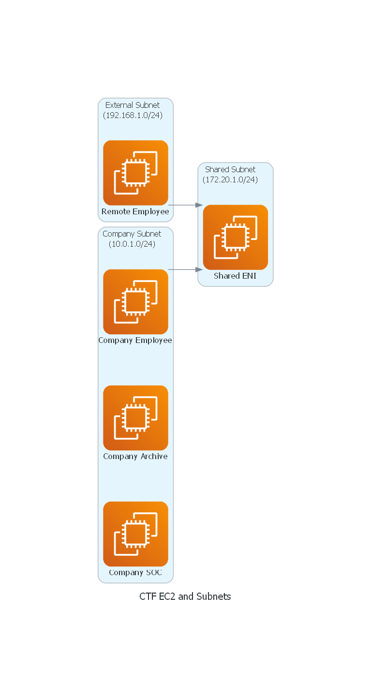
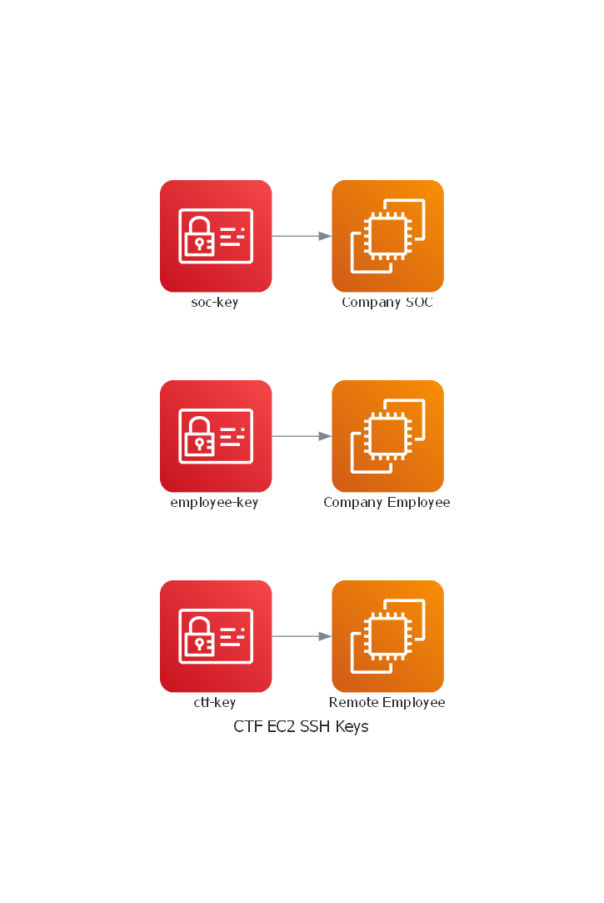

# Scenariusz CTF z wykorzystaniem infrastruktury AWS

## Spis treści

- Dla prowadzącego
  - [1. Infrastruktura AWS CTF](#1-infrastruktura-aws-ctf)
  - [2. Inicjalizacja infrastruktury od zera (ręcznie)](#2-inicjalizacja-infrastruktury-od-zera-ręcznie)
  - [3. Inicjalizacja infrastruktury za pomocą skryptu (VM AWS-CTF)](#3-inicjalizacja-infrastruktury-za-pomocą-skryptu-vm-aws-ctf)
  - [4. Jak znaleźć flagi](#4-jak-znaleźć-flagi)
  - [5. Rozwiązywanie problemów](#5-rozwiązywanie-problemów)
  - [6. Uwagi ogólne](#6-uwagi-ogólne)
  - [7. Załączniki - Skrypty](#7-załączniki---skrypty)

---

## Dla prowadzącego

### 1. Infrastruktura AWS CTF

Infrastruktura AWS tworzona jest za pomocą oprogramowania **Terraform**.

Zastosowane elementy:

- EC2
- SSH
- dostęp do plików i kluczy na instancjach
- sieci VPC

#### Diagramy architektury:

| S3 File Management | EC2 and Subnets | EC2 SSH Keys |
|:------------------:|:----------------:|:------------:|
|  |  |  |

### 2. Inicjalizacja infrastruktury od zera (ręcznie)

**Uwaga:** zalecana jest wersja z VM. Ręczna inicjalizacja nie wspiera automatycznego sprawdzania flag.

#### A) Wymagania:

- Git
- Python
- Terraform
- AWS CLI

#### B) Klonowanie repozytorium

```bash
git clone https://github.com/kajahl/ctf-aws-company-vpn-scenario
```

Repozytorium zawiera szablony konfiguracji.

#### C) Plik z tokenami

Utwórz plik `~/.aws/credentials` (opisany wcześniej).

#### D) Plik `flags.csv`

Przykład przed:

```
1;nazwa karty sieciowej /w EC2:Remote_Employee;FLAGA_CTF_1
```

Po:

```
1;nazwa karty sieciowej /w EC2:Remote_Employee;FLAGA_CTF_1;ctf-karta-sieciowa
```

Uruchom:

```bash
python3 scripts/initialize.py
```

#### E) Tworzenie infrastruktury

```bash
terraform apply -auto-approve
```

#### F) Usuwanie infrastruktury

```bash
terraform destroy -auto-approve
```

#### G) Czyszczenie plików

```bash
python3 scripts/clear.py
```

---

### 3. Inicjalizacja infrastruktury za pomocą skryptu (VM AWS-CTF)

Pełny proces opisany w części „Dla uczestnika”.

---

### 4. Jak znaleźć flagi?

**Lista flag i lokalizacji:**

| ID | EC2               | Lokalizacja                        | Wskazówka                          |
|----|-------------------|------------------------------------|------------------------------------|
| 1  | Remote_Employee   | Nazwa karty sieciowej             | `ifconfig`                         |
| 2  | Company_Archive   | Strona HTML                        | `curl <ip>`                        |
| 3–8| Company_Archive   | Pliki tekstowe                     | FTP, analiza                       |
| 9–15| Company_SOC      | Pliki logów, notatek, jpg, itp.    | grep, file, etc.                   |
| 16 | Company_Archive   | Nazwa pliku `.pem`                 | nazwa pliku = flaga                |
| 17–19| Remote_Employee | Pliki `.txt`                       | różne formaty flag i kodowanie     |

**Typy flag:**

1. `CTF[FLAGA]`: `grep -E 'CTF\[[a-zA-Z0-9]{10}\]'`
2. `FLAGA`: `grep -E '\b[a-zA-Z0-9]{10}\b'`
3. `ctf-FLAGA`: `grep -E 'ctf-[a-zA-Z0-9]{10}'`
4. Base64: `echo flaga_base64== | base64 -d`

---

### 5. Rozwiązywanie problemów

#### A) Zawieszanie się maszyny

Rozwiązanie: zmiana rozmiaru okna VM.

#### B) Błąd w `terraform`

Usunąć infrastrukturę i spróbować ponownie:

```bash
terraform destroy -auto-approve
```

#### C) Błąd `./init.sh`

Wejdź na konto root:

```bash
su -
# hasło: CTFadmin321*
```

Sprawdź logi – ścieżka podana w komunikacie.

---

### 6. Uwagi ogólne

Zastosowano plik `~/.aws/credentials`, ponieważ konta studenckie AWS mają ograniczenia IAM.

---

## 7. Załączniki – Skrypty

Zawarte skrypty (ścieżki, bash):

- `/opt/ctf/scripts/check_tf_lock.sh`
- `/opt/ctf/scripts/check_aws_creds.sh`
- `/opt/ctf/scripts/clone_repo.sh`
- `/opt/ctf/scripts/clear_files.sh`
- `/opt/ctf/scripts/init.sh`
- `/opt/ctf/scripts/generate_flags.sh`
- `/opt/ctf/scripts/generate_flag_file.sh`
- `/opt/ctf/scripts/terraform_up.sh`
- `/opt/ctf/scripts/generate_aws_files.sh`
- `/opt/ctf/scripts/setup_remote_employee_data.sh`
- `/opt/ctf/scripts/destroy.sh`
- `/opt/ctf/scripts/terraform_down.sh`

Wszystkie skrypty zawierają mechanizmy sprawdzania błędów (`set -euo pipefail`), logowania oraz nadawania odpowiednich uprawnień.