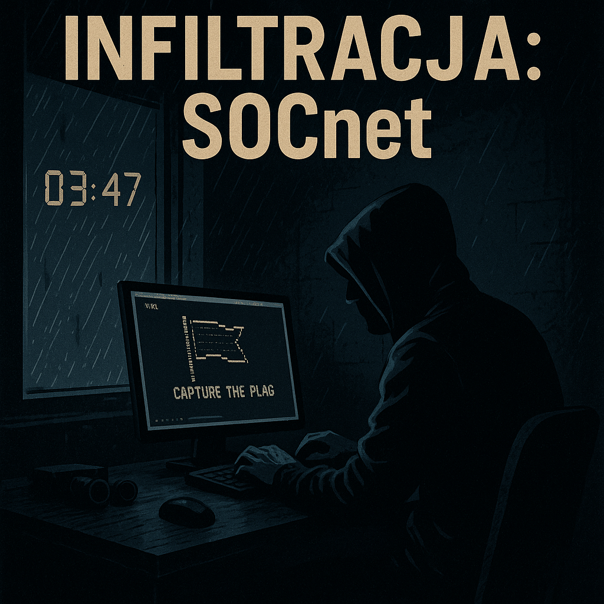

# Scenariusz CTF z wykorzystaniem infrastruktury AWS

## Spis treści

- Dla uczestnika
  - [1. Scenariusz](#1-scenariusz)
  - [2. Wstęp](#2-wstęp)
  - [3. Jak uruchomić scenariusz](#3-jak-uruchomić-scenariusz)
  - [4. Załączniki](#4-załączniki)

---

## Dla uczestnika

### 1. Scenariusz

**"INFILTRACJA: SOCnet"**



*Godzina 03:47. Deszcz bębni o parapet, ekran komputera rozświetla mrok pomieszczenia.*

*Jesteś sam — tylko ty, twoje narzędzia i zlecenie, którego nie możesz odrzucić.*

*Kilka dni temu pojawiła się luka. Błąd jednego z młodszych analityków SOC, niedopatrzenie w konfiguracji zdalnego pulpitu, nieaktualna łatka zabezpieczeń… klasyk. To twoje okno – szansa, by wślizgnąć się do środka jednej z największych firm technologicznych w regionie.*

*Zyskujesz dostęp do jego stacji roboczej — "External PC" — niepozornej maszyny zdalnej pracownika, która okazuje się być idealnym punktem wejścia. Za tą wirtualną fasadą kryje się cała firmowa sieć: skomplikowany ekosystem maszyn, usług i danych. Twoim zadaniem jest jedno — eksplorować, przenikać i zbierać. Każda flaga to ślad twojej obecności. Każda zdobyta informacja to punkt przewagi.*

*W tej symulacji stajesz się tym, kogo oni boją się najbardziej — cieniem, który porusza się poza radarami. Gotowy na zanurzenie się w SOCnet?*


### 2. Wstęp

Założenia ćwiczenia CTF:

- Uczestnik rozpoczyna od dostępu do zewnętrznego komputera pracownika
- W sieci firmowej znajdują się komputery z różnymi zasobami
- Celem jest zdobycie jak największej ilości ukrytych flag w różnych częściach infrastruktury i zasobów

Oczekiwane umiejętności:

- poruszanie się po sieci (`ssh`, `nmap`)
- poruszanie się po systemie Linux (`ifconfig`, `cd`, `chmod`)
- poruszanie się po zasobach sieciowych (`ftp`, `www`, `wget`, `curl`)
- umiejętność wyszukiwania informacji w plikach (`cat`, `grep`)
- umiejętność rozpoznawania plików (`file`)

Środowisko:

- Infrastruktura hostowana na AWS
- Wykorzystanie AWS VPC do izolacji sieci
- Wewnętrzne instancje EC2 symulujące środowisko korporacyjne
- S3 Bucket do wgrywania plików na instancje EC2

### 3. Jak uruchomić scenariusz

#### A) Przygotowanie maszyny wirtualnej

1. Pobierz plik [`AWS-CTF-v2.ova`](https://drive.google.com/file/d/1FO7rIJOVRkcNJ98Jc_lPHAsHYU2zGBGq/view)
2. Zaimportuj maszynę wirtualną oraz uruchom ją
3. Zaloguj się na użytkownika `ctfuser` z hasłem `userctf123`

#### B) Opis maszyny wirtualnej

Maszyna zawiera 3 foldery na pulpicie:

- `AWS`: plik z danymi uwierzytelniającymi
- `Skrypty`: 4 skrypty (inicjalizacja, usuwanie, check, list)
- `ConnectData`: IP i klucz do pierwszej maszyny

#### C) Konfiguracja AWS CLI

1. Zaloguj się na platformę AWS, uruchom laboratorium (Start Lab)
2. W folderze `AWS` znajdziesz plik `credentials`
3. Wklej dane z twojego AWS CLI:

```ini
[default]
aws_access_key_id = TWÓJ_KLUCZ_AKCESYJNY
aws_secret_access_key = TWÓJ_SEKRETNY_KLUCZ
aws_session_token = TWÓJ_TOKEN_SESJI
```

#### D) Opis skryptów

```bash
./init.sh -p       # Inicjalizacja scenariusza (z opcją ponownego pobrania repo)
./destroy.sh       # Czyszczenie infrastruktury
./check.sh <flaga> # Weryfikacja flagi
./list.sh          # Lista zdobytych flag
```

Flagi: ciąg 10 znaków, np.:

- `ctf-ab12cd34ef`
- `CTF{5d72df4a8c}`
- `62gc5j3zd2`

Przykład:

```bash
./check.sh a1b2c3d4
```

#### E) Uruchomienie scenariusza

```bash
./init.sh -p
```

Poprawny output:

```
[+] Terraform apply zakończone sukcesem.
[+] Publiczne IP instancji: 111.222.111.222
```

#### F) Połączenie do pierwszej maszyny

```bash
ssh ubuntu@<IP> -i key.pem
```

Domyślny użytkownik: `ubuntu`

#### G) Kończenie scenariusza

```bash
./destroy.sh
```

### 4. Załączniki

#### Przydatne komendy

```bash
ssh -i <klucz.pem> ubuntu@<ip>
sudo nmap -sV <ip>/<maska>
curl <ip>:<port>/<zasób>
lftp <login>@<ip>
wget -r --ftp-user=<login> --ftp-password=<hasło> ftp://<ip>
cat <plik>
grep -n <plik>
head -n 20 <plik>
file <plik>
echo "base64==" | base64 -d
```